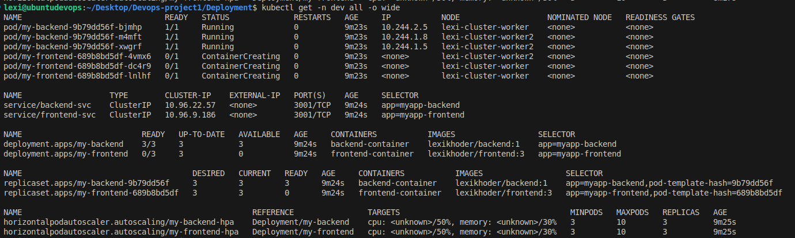

# Deployed A Tier Application on Kubernetes Cluster Eks

Containerized and deployed a full-stack application on a Kubernetes cluster, utilizing an Ingress controller to expose the application to the internet.

## Deployment using Helm Chart
### Deployment.yaml
```javascript
apiVersion: apps/v1
kind: Deployment
metadata:
  name: {{.Values.frontendDeploymentName}} 
  namespace: {{.Values.environment}} 
  labels:
    env: {{.Values.environment}}
    type: {{.Values.frontendDeploymentName}}
spec:
  replicas: {{.Values.frontendPodsReplicas}}
  selector:
    matchLabels:
      app: {{.Values.frontendPodLabel}} 
  template:
    metadata:
      name: {{.Values.frontendPodName}}
      labels:
        app: {{.Values.frontendPodLabel}}   
    spec:
      containers:
      - name: {{.Values.frontendContainerName}}
        image: {{.Values.frontendImage}}
        ports:
        - containerPort: {{.Values.frontendContainerPort}} #this is the pod port that the container listens to
        resources:
          requests:
            cpu: {{.Values.frontendRequests.cpu}}
            memory: {{.Values.frontendRequests.memory}}
          limits:
            cpu: {{.Values.frontendLimits.cpu}}
            memory: {{.Values.frontendLimits.memory}}

---

apiVersion: apps/v1
kind: Deployment
metadata:
  name: {{.Values.backendDeploymentName}} 
  namespace: {{.Values.environment}}
  labels:
    env: {{.Values.environment}}
    type: {{.Values.backendDeploymentName}} 
spec:
   replicas: {{.Values.backendPodsReplicas}}
   selector:
    matchLabels:
      app: {{.Values.backendPodLabel}} 
   template:
    metadata:
      name: {{.Values.backendPodName}}
      labels:
        app: {{.Values.backendPodLabel}}   
    spec:
      containers:
      - name: {{.Values.backendContainerName}}
        image: {{.Values.backendImage}}
        ports:
        - containerPort: {{.Values.backendContainerPort}} #this is the pod port that the container listens to
        resources:
          requests:
            cpu: {{.Values.backendRequests.cpu}}
            memory: {{.Values.backendRequests.memory}}
          limits:
            cpu: {{.Values.backendLimits.cpu}}
            memory: {{.Values.backendLimits.memory}}

```
### Services.yaml
```javascript
apiVersion: v1
kind: Service
metadata:
  name: {{.Values.frontendSvcName}}
  namespace: {{.Values.environment}}
  labels:
    env: {{.Values.environment}}
spec:
  selector:
    app: {{.Values.frontendPodLabel}} 
  type: ClusterIP
  ports:
  - port: {{.Values.frontendClusteripPort}} # this can be any port it communicate with all similar pods internally
    targetPort: {{.Values.frontendContainerPort}} # this port should match the container port in the pod

---
apiVersion: v1
kind: Service
metadata:
  name: {{.Values.backendSvcName}}
  namespace: {{.Values.environment}}
  labels:
    env: {{.Values.environment}}
spec:
  selector:
    app: {{.Values.backendPodLabel}}
  type: ClusterIP
  ports:
  - port: {{.Values.backendClusteripPort}} # this can be any port it communicate with all similar pods internally
    targetPort: {{.Values.backendContainerPort}} # this port should match the container port in the pod

```

### Ingress Rules

```javascript
apiVersion: networking.k8s.io/v1
kind: Ingress
metadata:
  name: {{.Values.ingressRulesName}}
  namespace: {{.Values.environment}}
  annotations:
    nginx.ingress.kubernetes.io/rewrite-target: /
spec:
  ingressClassName: nginx
  rules:
  - http:
      paths:
      - path: /frontend
        pathType: Prefix
        backend:
          service:
            name: {{.Values.backendSvcName}}
            port:
              number: {{.Values.frontendClusteripPort}}
      - path: /backend
        pathType: Prefix
        backend:
          service:
            name: {{.Values.backendSvcName}}
            port:
              number: {{.Values.backendClusteripPort}}
```

### values.yaml
```javascript
# backend values
backendImage: lexikhoder/backend:1
backendDeploymentName: my-backend
backendPodName: my-backend-pod
backendPodLabel: myapp-backend
backendContainerName: backend-container
backendPodsReplicas: 3
backendPodsMaxreplicas: 10
backendContainerPort: 3000
backendHorizonzalpodautoscalerName: my-backend-hpa
backendPodCpuUtilization: 50 # its in %
backendPodMemoryUtilization: 30 # its in %
backendRequests:
      cpu: "200m"
      memory: "128Mi"
backendLimits:
      cpu: "500m"
      memory: "256Mi"
# backendend svc
backendClusteripPort: 3001
backendSvcName: backend-svc

# frontend values
frontendImage: lexikhoder/frontend:1
frontendDeploymentName: my-frontend
frontendPodName: my-frontend-pod
frontendPodLabel: myapp-frontend
frontendContainerName: frontend-container
frontendPodsReplicas: 3
frontendPodsMaxreplicas: 10
frontendContainerPort: 3000
frontendHorizonzalPodautoscalerName: my-frontend-hpa
frontendPodCpuUtilization: 50 # its in %
frontendPodMemoryUtilization: 30 # its in %
frontendRequests:
      cpu: "200m"
      memory: "128Mi"
frontendLimits:
      cpu: "500m"
      memory: "256Mi"
# frontend svc
frontendClusteripPort: 3001
frontendSvcName: frontend-svc


# ingress controller values
# cluster vpc cidr update when using eks or any other standard cluster
proxyRealIpCidr: 10.0.0.0/16
# update the amazon certificate manager(acm) here
sslCertManagerArn: arn:aws:acm:us-west-2:XXXXXXXX:certificate/XXXXXX-XXXXXXX-XXXXXXX-XXXXXXXX

# ingress rules values 
ingressRulesName: my-ingress


```

## Setting up Argocd 
```javascript
apiVersion: argoproj.io/v1alpha1
kind: Application
metadata:
  name: argocd-project
  namespace: argocd
spec:
  project: default
  source:
    repoURL: https://github.com/lexicoder1/Helm-chart.git
    targetRevision: HEAD
    path: Deployment/Deployment # Update this to the path of your Helm chart within the repository
    helm:
      valueFiles:
        - values.yaml # The default values file
        - values-dev.yaml # The environment-specific values file for "dev"
  destination:
    server: https://kubernetes.default.svc
    namespace: dev
  syncPolicy:
    syncOptions:
      - CreateNamespace=true
    automated:
      selfHeal: true
      prune: true
```
### Command
```javascript
 helm install my-deploy ./Deployment  --values Deployment/values.yaml -f Deployment/values-dev.yaml
```

## Result
